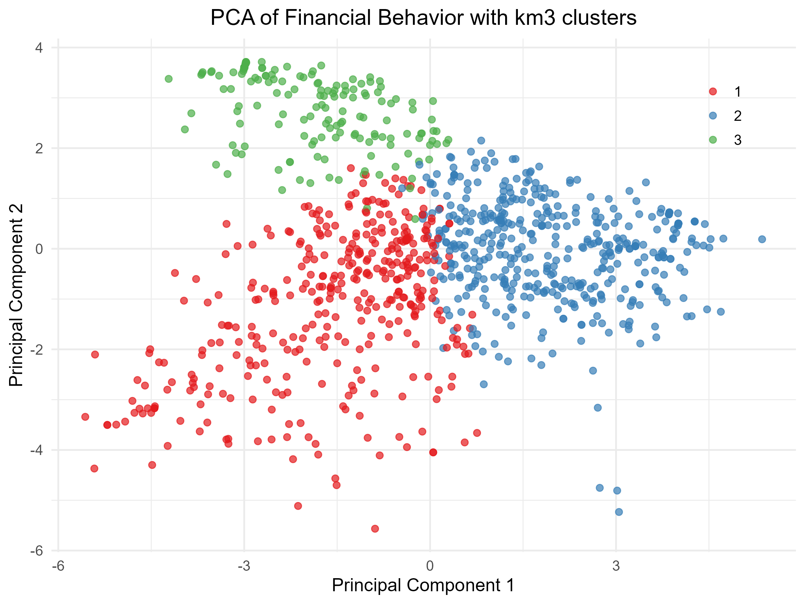
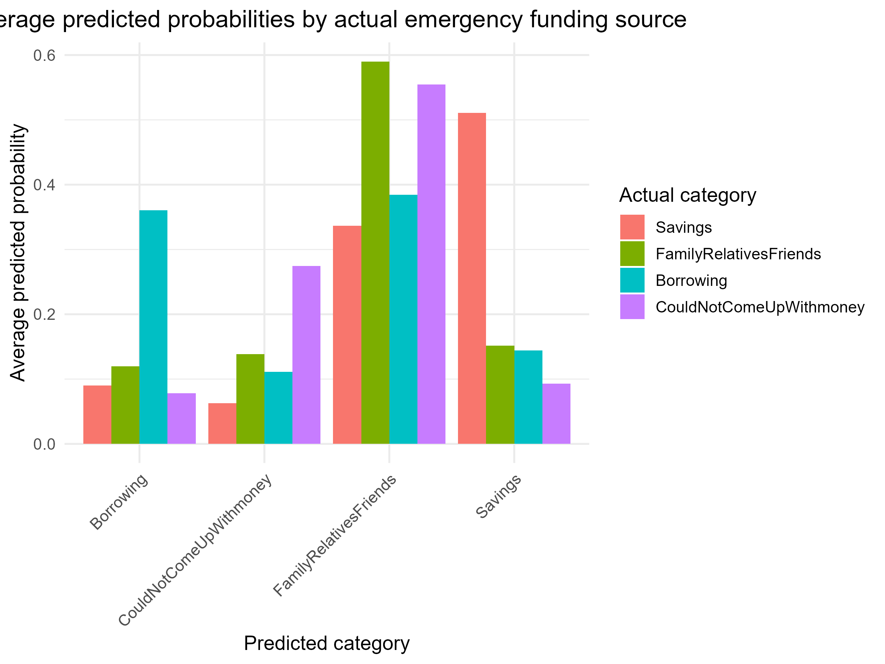

# Financial Behavior Analysis & Emergency Funding Prediction – Kazakhstan

## What?
Analysis of financial behavior survey data to identify distinct consumer profiles and predict how individuals source emergency funds within 30 days.

## Why?
Financial institutions and policymakers need to understand digital adoption gaps, credit access patterns, and emergency liquidity sources to design targeted financial inclusion strategies and product offerings in emerging markets.

## Data Source
[World Bank Global Findex Database – Kazakhstan](https://microdata.worldbank.org/catalog/7925/get-microdata)

## How?
- **Data Preprocessing**: Removed >70% missing values, treated non-responses as NA, dropped highly correlated features (r > 0.70)
- **Dimensionality Reduction**: PCA extracted two main components – financial engagement/borrowing behavior and digital vs. traditional usage
- **Unsupervised Learning**: K-means and hierarchical clustering (k=3 optimal) segmented consumers using Elbow and Silhouette methods
- **Supervised Learning**: Multinomial regression and random forest (5-fold CV, 70/30 train-test split) predicted emergency fund sources
- **Tech Stack**: R, tidyverse, caret, randomForest, nnet, cluster, ggplot2

## Result (Quantified Outcomes)
- **3 distinct consumer segments** identified, explaining financial inclusion heterogeneity

- **Supervised models** achieved balanced accuracy of **0.55–0.68** across emergency funding classes
- **Specificity >0.87** across models (strong identification of non-members)
- **Random forest** showed highest balanced accuracy for Borrowing class: **0.665**
- **Top predictors** of emergency funding: savings behavior, formal borrowing history, pension receipt, education level, income quartile

## Quick Reference – Consumer Segments

| Segment | Key Traits | Emergency Funding Pattern |
|---------|------------|---------------------------|
| Basic Account Holders | 100% bank accounts, low digital adoption, older (45.4 yrs) | Savings / Could not come up |
| Digitally Active Users | 96% borrowing, 78% online purchases, young (39.2 yrs), 86% employed | Borrowing / Family & friends |
| Partially Included | 35% bank accounts, rural, lower education, 65% women | Family & friends / Other |
